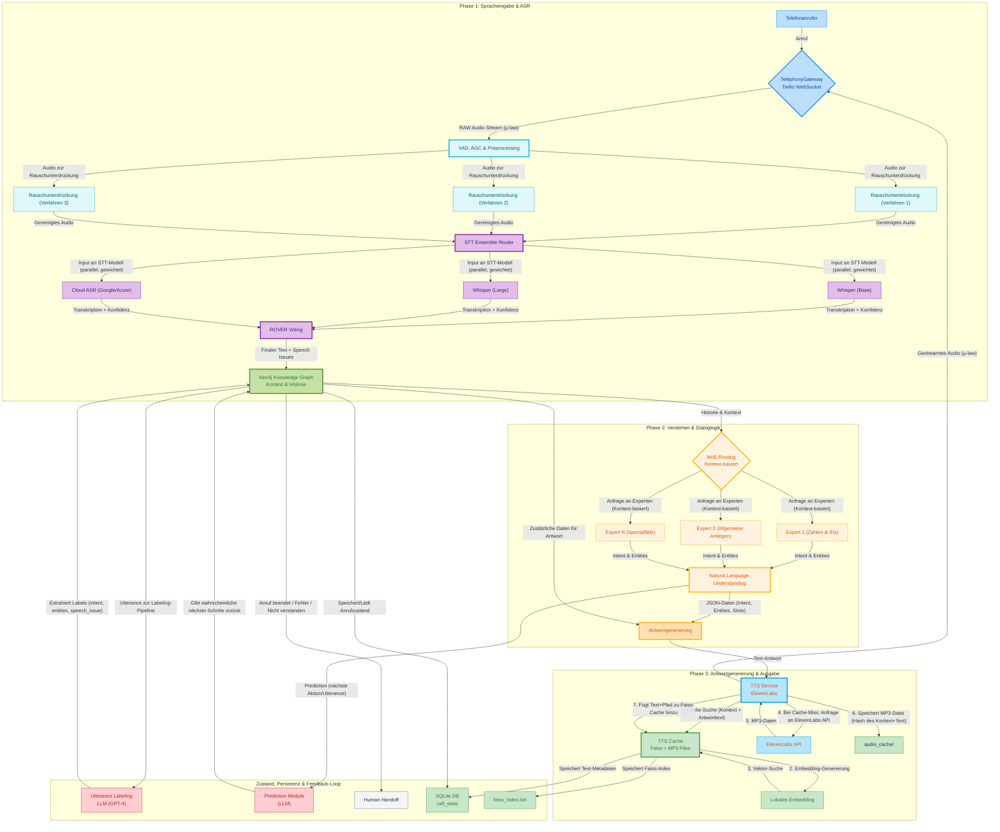
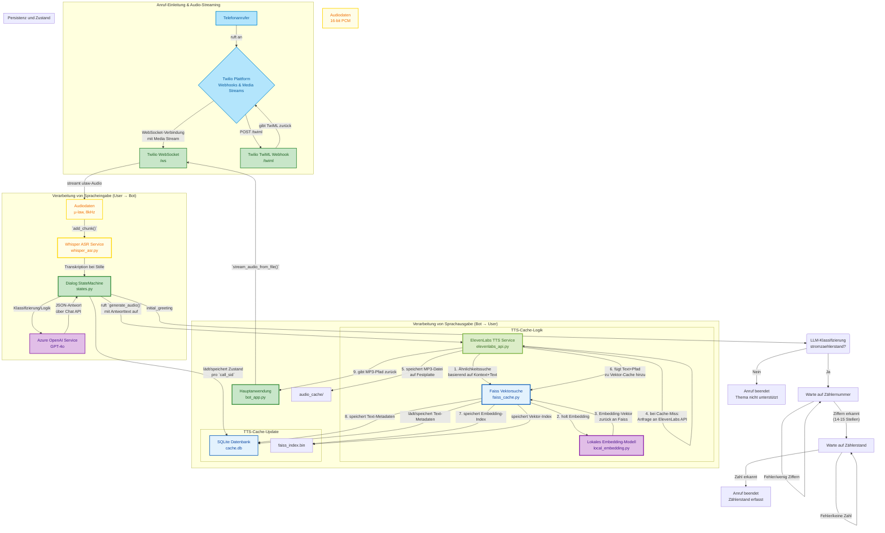

```mermaid

%% ======= ULTRA-DETAILED VOICEBOT ARCHITEKTUR: CLASS DEFINITIONS (Teil 1/3) =======

graph TD

%% --- USER DEVICES, ENDPOINTS ---
classDef user fill:#fff8e1,stroke:#fbc02d,color:#bf360c,stroke-width:2.5px
classDef user_mobile fill:#ffe0b2,stroke:#ffb300,color:#e65100,stroke-width:2.5px
classDef user_landline fill:#fffde7,stroke:#ffd600,color:#4e2600,stroke-width:2.5px
classDef user_softphone fill:#ede7f6,stroke:#7e57c2,color:#512da8,stroke-width:2.5px
classDef user_tablet fill:#f3e5f5,stroke:#8e24aa,color:#4527a0,stroke-width:2.5px
classDef user_special fill:#b3e5fc,stroke:#039be5,color:#01579b,stroke-width:2.5px

%% --- HOME/OFFICE NETWORK, ROUTING, FIREWALL ---
classDef homenet fill:#c5cae9,stroke:#512da8,color:#1a237e,stroke-width:2.5px
classDef wan fill:#b3e5fc,stroke:#0288d1,color:#01579b,stroke-width:2.5px
classDef nat fill:#b2dfdb,stroke:#00897b,color:#263238,stroke-width:2px
classDef router fill:#ffe0b2,stroke:#ef6c00,color:#e65100,stroke-width:2.5px
classDef firewall fill:#ffebee,stroke:#c62828,color:#b71c1c,stroke-width:2.5px
classDef ddos fill:#c8e6c9,stroke:#43a047,color:#388e3c,stroke-width:2.5px
classDef abuse fill:#ffcdd2,stroke:#b71c1c,color:#b71c1c,stroke-width:2.5px
classDef block fill:#263238,stroke:#ff1744,color:#fff,stroke-width:2.5px

%% --- PROVIDER, INTERNET, DNS ---
classDef isp fill:#cfd8dc,stroke:#607d8b,color:#263238,stroke-width:2.5px
classDef dns fill:#fff8e1,stroke:#ffeb3b,color:#ff6f00,stroke-width:2px
classDef cloud fill:#e3f2fd,stroke:#1976d2,color:#01579b,stroke-width:2.5px

%% --- FRITZBOX, PBX, TELEPHONY CORE ---
classDef fb fill:#b39ddb,stroke:#512da8,color:#fff,stroke-width:3px
classDef fb_sip fill:#bbdefb,stroke:#1565c0,color:#1a237e,stroke-width:3px
classDef fb_media fill:#ede7f6,stroke:#7e57c2,color:#1a237e,stroke-width:2.5px
classDef fb_ctrl fill:#fff3e0,stroke:#fbc02d,color:#6a1b9a,stroke-width:2px
classDef fb_monitor fill:#ffe0b2,stroke:#ef6c00,color:#bf360c,stroke-width:2px
classDef fb_api fill:#c5e1a5,stroke:#33691e,color:#388e3c,stroke-width:2.5px
classDef fb_event fill:#ffd54f,stroke:#ff8f00,color:#4e2600,stroke-width:2px

%% --- AUDIO STREAMING, RTP, JITTER, DTMF, CODEC, PLC ---
classDef media fill:#f3e5f5,stroke:#8e24aa,color:#4527a0,stroke-width:2.5px
classDef rtp fill:#e1f5fe,stroke:#039be5,color:#01579b,stroke-width:2.5px
classDef audio_pipe fill:#b2dfdb,stroke:#00796b,color:#263238,stroke-width:2px
classDef dtmf fill:#fff9c4,stroke:#fbc02d,color:#ff6f00,stroke-width:2.5px
classDef jitter fill:#b3e5fc,stroke:#039be5,color:#d84315,stroke-width:2.5px
classDef codec fill:#f8bbd0,stroke:#ad1457,color:#880e4f,stroke-width:2px
classDef plc fill:#bdbdbd,stroke:#616161,color:#263238,stroke-width:2.5px
classDef silence fill:#bdbdbd,stroke:#616161,color:#263238,stroke-width:2px

%% --- AUDIO PREPROCESSING, VAD, NS, AGC, AEC, FILTERS ---
classDef preproc fill:#e0f2f1,stroke:#00796b,color:#00695c,stroke-width:2.5px
classDef vad fill:#fffde7,stroke:#ffd600,color:#ef6c00,stroke-width:2.5px
classDef ns fill:#e0f7fa,stroke:#00bcd4,color:#006064,stroke-width:2px
classDef agc fill:#fff9c4,stroke:#fbc02d,color:#bf360c,stroke-width:2px
classDef echo fill:#c8e6c9,stroke:#43a047,color:#004d40,stroke-width:2px
classDef filter fill:#fffde7,stroke:#ffd600,color:#ef6c00,stroke-width:2.5px
classDef clip fill:#ffecb3,stroke:#fbc02d,color:#b71c1c,stroke-width:2.5px

%% --- FEATURE EXTRACTION, SEGMENTING, CHUNK/TRIM, AUDIO META ---
classDef feature fill:#e3f2fd,stroke:#1565c0,color:#1565c0,stroke-width:2px
classDef chunk fill:#ede7f6,stroke:#8e24aa,color:#4527a0,stroke-width:2px
classDef trim fill:#ffe0b2,stroke:#ffb300,color:#a04000,stroke-width:2px
classDef audiometa fill:#f8bbd0,stroke:#ad1457,color:#880e4f,stroke-width:2.5px

%% --- RECORDING, STORAGE, AUDIT, ARCHIVE, QA ---
classDef record fill:#cfd8dc,stroke:#37474f,color:#263238,stroke-width:2.5px
classDef storage fill:#e3f2fd,stroke:#1976d2,color:#01579b,stroke-width:2px
classDef qa fill:#f8bbd0,stroke:#ad1457,color:#880e4f,stroke-width:2.5px
classDef audit fill:#c8e6c9,stroke:#388e3c,color:#004d40,stroke-width:2.5px
classDef legal fill:#ffebee,stroke:#c62828,color:#b71c1c,stroke-width:2.5px
classDef privacy fill:#fffde7,stroke:#ffd600,color:#b28704,stroke-width:2px
classDef gdpr fill:#f5f5f5,stroke:#263238,color:#607d8b,stroke-width:2.5px

%% --- EVENTS, PUBSUB, ROUTING, QA FEEDBACK, PIPE META ---
classDef event fill:#fff9c4,stroke:#fbc02d,color:#bf360c,stroke-width:2.5px
classDef pubsub fill:#dcedc8,stroke:#7cb342,color:#33691e,stroke-width:2px
classDef router fill:#e1bee7,stroke:#6a1b9a,color:#2e1539,stroke-width:2px
classDef ctrl fill:#d1c4e9,stroke:#7e57c2,color:#4527a0,stroke-width:2.5px
classDef feedback fill:#fffde7,stroke:#ffd600,color:#c43e00,stroke-width:2px

%% ======= ULTRA-DETAILED VOICEBOT ARCHITEKTUR: CLASS DEFINITIONS (Teil 2/3) =======

%% --- STT/ASR/ENSEMBLE/QA/DRIFT/SHADOW ---
classDef stt fill:#ffe0b2,stroke:#fbc02d,color:#b28704,stroke-width:2.5px
classDef asr fill:#fffde7,stroke:#ffd600,color:#b28704,stroke-width:2.5px
classDef asr_edge fill:#e1f5fe,stroke:#0288d1,color:#039be5,stroke-width:2.5px
classDef stt_shadow fill:#fff9c4,stroke:#fbc02d,color:#c43e00,stroke-width:2.5px
classDef voting fill:#ffd54f,stroke:#ff8f00,color:#4e2600,stroke-width:3px
classDef drift fill:#ffd180,stroke:#ff8a65,color:#d84315,stroke-width:2px
classDef qa_stt fill:#d1c4e9,stroke:#512da8,color:#212121,stroke-width:2.5px
classDef stt_meta fill:#fffde7,stroke:#ffd600,color:#b28704,stroke-width:2px
classDef stt_sim fill:#cfd8dc,stroke:#263238,color:#37474f,stroke-width:2.5px
classDef stt_debug fill:#f8bbd0,stroke:#ad1457,color:#880e4f,stroke-width:2.5px
classDef stt_train fill:#e3f2fd,stroke:#1e88e5,color:#0d47a1,stroke-width:2.5px
classDef stt_fallback fill:#b3e5fc,stroke:#039be5,color:#01579b,stroke-width:2.5px
classDef stt_dev fill:#ffe0b2,stroke:#ef6c00,color:#c43e00,stroke-width:2.5px

%% --- LLM, NLU, DIALOG MGMT, INTENT, ENTITY, NER, PREDICTION ---
classDef llm fill:#f8bbd0,stroke:#ad1457,color:#880e4f,stroke-width:2.5px
classDef nlu fill:#fff3e0,stroke:#ffb300,color:#e65100,stroke-width:2.5px
classDef intent fill:#ffe0b2,stroke:#ef6c00,color:#ff6f00,stroke-width:2.5px
classDef ner fill:#e3f2fd,stroke:#0288d1,color:#01579b,stroke-width:2.5px
classDef dialog fill:#dcedc8,stroke:#7cb342,color:#33691e,stroke-width:2.5px
classDef prediction fill:#d1c4e9,stroke:#9575cd,color:#4527a0,stroke-width:2.5px
classDef prompt fill:#ede7f6,stroke:#7e57c2,color:#512da8,stroke-width:2.5px
classDef sem fill:#e1bee7,stroke:#8e24aa,color:#4a148c,stroke-width:2.5px
classDef context fill:#fff9c4,stroke:#fbc02d,color:#ff6f00,stroke-width:2.5px
classDef slot fill:#ffe082,stroke:#ffb300,color:#c43e00,stroke-width:2.5px

%% --- MoE/EXPERTEN/KI ROUTING/MODEL HUBS ---
classDef moe fill:#fff9c4,stroke:#fbc02d,color:#f57c00,stroke-width:2.5px
classDef moe_router fill:#fffde7,stroke:#ffd600,color:#c43e00,stroke-width:2.5px
classDef moe_gate fill:#ffe0b2,stroke:#fbc02d,color:#d84315,stroke-width:2.5px
classDef moe_expert fill:#c5e1a5,stroke:#33691e,color:#388e3c,stroke-width:2.5px
classDef moe_shadow fill:#fff3e0,stroke:#ffb300,color:#6a1b9a,stroke-width:2.5px
classDef moe_qa fill:#e0f7fa,stroke:#00bcd4,color:#006064,stroke-width:2.5px
classDef moe_meta fill:#fffde7,stroke:#ffd600,color:#b28704,stroke-width:2px

%% --- RAG / RETRIEVAL / RAG CACHE / RAG TRAIN ---
classDef rag fill:#fff8e1,stroke:#ffe082,color:#795548,stroke-width:2.5px
classDef rag_cache fill:#ffe0b2,stroke:#fbc02d,color:#6d4c41,stroke-width:2.5px
classDef rag_legal fill:#f5f5f5,stroke:#263238,color:#b71c1c,stroke-width:2.5px
classDef rag_shadow fill:#fffde7,stroke:#ffd600,color:#bf360c,stroke-width:2.5px
classDef rag_qa fill:#c8e6c9,stroke:#388e3c,color:#004d40,stroke-width:2.5px
classDef rag_feedback fill:#fff3e0,stroke:#fbc02d,color:#e65100,stroke-width:2px
classDef rag_train fill:#e3f2fd,stroke:#1976d2,color:#0d47a1,stroke-width:2.5px
classDef rag_explain fill:#d1c4e9,stroke:#7e57c2,color:#4527a0,stroke-width:2px

%% --- GRAPHDB / NEO4J / KG / ONTOLOGIE / GRAPH OPS / GRAPH-RAG ---
classDef graphdb fill:#f3e5f5,stroke:#6a1b9a,color:#311b92,stroke-width:3px
classDef graphapi fill:#ede7f6,stroke:#9575cd,color:#4527a0,stroke-width:2.5px
classDef graphadmin fill:#c5cae9,stroke:#512da8,color:#311b92,stroke-width:2px
classDef graphkg fill:#dcedc8,stroke:#558b2f,color:#212121,stroke-width:2.5px
classDef graphmeta fill:#fffde7,stroke:#ffd600,color:#b28704,stroke-width:2.5px
classDef graphauth fill:#f5f5f5,stroke:#263238,color:#d84315,stroke-width:2.5px
classDef graphcache fill:#c8e6c9,stroke:#388e3c,color:#004d40,stroke-width:2.5px
classDef graphops fill:#ffe082,stroke:#ffb300,color:#bf360c,stroke-width:2.5px
classDef graphshadow fill:#fff9c4,stroke:#fbc02d,color:#c43e00,stroke-width:2.5px
classDef graphqa fill:#d1c4e9,stroke:#512da8,color:#212121,stroke-width:2.5px
classDef graphlabel fill:#fff8e1,stroke:#fbc02d,color:#4527a0,stroke-width:2.5px
classDef graphtrain fill:#e3f2fd,stroke:#1e88e5,color:#0d47a1,stroke-width:2.5px
classDef graphaudit fill:#cfd8dc,stroke:#37474f,color:#263238,stroke-width:2.5px
classDef graphsim fill:#cfd8dc,stroke:#263238,color:#bf360c,stroke-width:2.5px
classDef graphhotfix fill:#ffecb3,stroke:#fbc02d,color:#b71c1c,stroke-width:2.5px

%% --- CACHE, DATAOPS, PIPELINE CACHE, ASYNC, BATCH ---
classDef cache fill:#c8e6c9,stroke:#388e3c,color:#004d40,stroke-width:2px
classDef cache_async fill:#ffe0b2,stroke:#fbc02d,color:#c43e00,stroke-width:2px
classDef cache_batch fill:#d1c4e9,stroke:#7e57c2,color:#4527a0,stroke-width:2px
classDef dataops fill:#e0f2f1,stroke:#26a69a,color:#004d40,stroke-width:2px
classDef batch fill:#ede7f6,stroke:#7e57c2,color:#4527a0,stroke-width:2.5px

%% --- LABELING, FEEDBACK, TRAINING, SIMULATION, QA, MANUAL OPS ---
classDef label fill:#fffde7,stroke:#ffd600,color:#c43e00,stroke-width:2.5px
classDef feedback fill:#fff3e0,stroke:#fbc02d,color:#e65100,stroke-width:2px
classDef train fill:#e3f2fd,stroke:#1e88e5,color:#0d47a1,stroke-width:2.5px
classDef sim fill:#cfd8dc,stroke:#263238,color:#37474f,stroke-width:2.5px
classDef dev fill:#ffe0b2,stroke:#ef6c00,color:#c43e00,stroke-width:2.5px
classDef autoqa fill:#f8bbd0,stroke:#ad1457,color:#880e4f,stroke-width:2.5px

%% --- LOGGING, MONITOR, ALERT, ADMIN, DEBUG, TEST, REPLAY, HOTFIX ---
classDef log fill:#fffde7,stroke:#fbc02d,color:#b28704,stroke-width:2.5px
classDef monitor fill:#d1c4e9,stroke:#311b92,color:#212121,stroke-width:2.5px
classDef alert fill:#ffcdd2,stroke:#c62828,color:#b71c1c,stroke-width:2.5px
classDef admin fill:#cfd8dc,stroke:#607d8b,color:#263238,stroke-width:2.5px
classDef debug fill:#f8bbd0,stroke:#ad1457,color:#880e4f,stroke-width:2.5px
classDef test fill:#e1bee7,stroke:#8e24aa,color:#4a148c,stroke-width:2.5px
classDef replay fill:#e3f2fd,stroke:#0288d1,color:#01579b,stroke-width:2.5px
classDef hotfix fill:#ffecb3,stroke:#fbc02d,color:#b71c1c,stroke-width:2.5px

%% ======= ULTRA-DETAILED VOICEBOT ARCHITEKTUR: CLASS DEFINITIONS (Teil 3/3) =======

%% --- OUTPUT, TTS, SYNTH, AUDIO SINK, MEDIA OUT ---
classDef tts fill:#b3e5fc,stroke:#039be5,color:#01579b,stroke-width:2.5px
classDef synth fill:#e1f5fe,stroke:#0288d1,color:#01579b,stroke-width:2.5px
classDef tts_cloud fill:#b2dfdb,stroke:#006064,color:#263238,stroke-width:2.5px
classDef tts_shadow fill:#fff9c4,stroke:#fbc02d,color:#bf360c,stroke-width:2.5px
classDef tts_qa fill:#f8bbd0,stroke:#ad1457,color:#880e4f,stroke-width:2.5px
classDef tts_train fill:#e3f2fd,stroke:#1e88e5,color:#0d47a1,stroke-width:2.5px
classDef tts_debug fill:#fbc02d,stroke:#ff9800,color:#c43e00,stroke-width:2.5px
classDef audioout fill:#e8f5e9,stroke:#43a047,color:#004d40,stroke-width:2.5px

%% --- TRANSFER, HANDOFF, HUMAN ESCALATION ---
classDef transfer fill:#ffccbc,stroke:#bf360c,color:#fff,stroke-width:2.5px
classDef handoff fill:#ffd180,stroke:#ff8a65,color:#d84315,stroke-width:2.5px
classDef human fill:#ffe0b2,stroke:#ef6c00,color:#bf360c,stroke-width:2.5px
classDef human_qa fill:#c5e1a5,stroke:#388e3c,color:#1b5e20,stroke-width:2.5px
classDef operator fill:#ede7f6,stroke:#7e57c2,color:#4527a0,stroke-width:2.5px

%% --- EMERGENCY, FALLBACK, CRITICAL ALERTS, ESCALATION ---
classDef emergency fill:#d50000,stroke:#ffebee,color:#fff,stroke-width:3px
classDef critical fill:#ff1744,stroke:#d50000,color:#fff,stroke-width:3px
classDef fail fill:#b71c1c,stroke:#fff8e1,color:#fff,stroke-width:2.5px
classDef panic fill:#ff6f00,stroke:#fffde7,color:#b71c1c,stroke-width:2.5px
classDef recovery fill:#b2ff59,stroke:#76ff03,color:#388e3c,stroke-width:2.5px

%% --- PROMPT ENGINEERING, FEED, ADAPTER, SCALING, ROUTER, GATE ---
classDef prompt fill:#fce4ec,stroke:#d81b60,color:#880e4f,stroke-width:2.5px
classDef adapter fill:#ffe57f,stroke:#ffd600,color:#fbc02d,stroke-width:2.5px
classDef scaling fill:#e1bee7,stroke:#8e24aa,color:#4a148c,stroke-width:2.5px
classDef gateway fill:#b3e5fc,stroke:#039be5,color:#004d40,stroke-width:2.5px
classDef orchestrator fill:#ede7f6,stroke:#5e35b1,color:#fff,stroke-width:3px
classDef router fill:#fff3e0,stroke:#fbc02d,color:#e65100,stroke-width:2.5px
classDef dispatcher fill:#fbc02d,stroke:#ff8f00,color:#c43e00,stroke-width:2.5px

%% --- DEVOPS, PIPELINE ADMIN, MIGRATION, EXPORT, IMPORT, VERSIONING ---
classDef devops fill:#d7ccc8,stroke:#4e342e,color:#263238,stroke-width:2.5px
classDef migration fill:#c5cae9,stroke:#512da8,color:#1a237e,stroke-width:2.5px
classDef export fill:#b2ebf2,stroke:#0097a7,color:#01579b,stroke-width:2.5px
classDef import fill:#fff8e1,stroke:#ffd600,color:#bf360c,stroke-width:2.5px
classDef version fill:#bdbdbd,stroke:#616161,color:#212121,stroke-width:2.5px
classDef staging fill:#ffe0b2,stroke:#ff9800,color:#a04000,stroke-width:2.5px
classDef backup fill:#b2dfdb,stroke:#00695c,color:#263238,stroke-width:2.5px

%% --- SHADOW, EXPERIMENT, TEST, REPLAY, HOTFIX ---
classDef shadow fill:#fff9c4,stroke:#fbc02d,color:#bf360c,stroke-width:2.5px
classDef exp fill:#ede7f6,stroke:#8e24aa,color:#4527a0,stroke-width:2.5px
classDef test fill:#e1bee7,stroke:#8e24aa,color:#4a148c,stroke-width:2.5px
classDef replay fill:#cfd8dc,stroke:#263238,color:#bf360c,stroke-width:2.5px
classDef hotfix fill:#ffecb3,stroke:#fbc02d,color:#b71c1c,stroke-width:2.5px
classDef staging fill:#e0e0e0,stroke:#757575,color:#424242,stroke-width:2.5px

%% --- MISC: HUMAN FEEDBACK, FEEDBACK QA, EXPLAIN, SIMULATION, METRICS, DOCS ---
classDef explainer fill:#fffde7,stroke:#ffd600,color:#4527a0,stroke-width:2.5px
classDef metrics fill:#e1f5fe,stroke:#0288d1,color:#01579b,stroke-width:2.5px
classDef docs fill:#f3e5f5,stroke:#6a1b9a,color:#311b92,stroke-width:2.5px
classDef ref fill:#f5f5f5,stroke:#263238,color:#607d8b,stroke-width:2.5px

%% ======= HYPER-DETAILED VOICEBOT ARCHITEKTUR (Inhalts-Teil 1/∞) =======

%% --- USER DEVICES (explizit, maximal redundant) ---
subgraph "User Devices & Entrypoints"
U_SMARTPHONE["fa:fa-mobile Smartphone (App, VoLTE, WLAN, iOS, Android, eSIM)"]:::user_mobile
U_FESTNETZ["fa:fa-phone-alt Festnetz/DECT-Telefon (HD Voice, Gigaset, Snom, FritzApp Fon)"]:::user_landline
U_SOFTPHONE["fa:fa-laptop Softphone/WebRTC (PC, Mac, Linux, Chrome, Teams, Zoom, SIP UA)"]:::user_softphone
U_TABLET["fa:fa-tablet Tablet (WiFi-Call, App, WebRTC, SIP, Android/iOS, Multimode)"]:::user_tablet
U_SMARTDEV["fa:fa-broadcast-tower Smart Speaker/Device (Alexa, Google, HomePod, IoT)"]:::user_special
U_SPECIAL["fa:fa-plug Spezialgerät (Alarm, Notruf, Telematik, Embedded, Auto-Connect)"]:::user_special
end

%% --- HOME NETWORK/ROUTER/ISP LAYER ---
subgraph "Netzwerk, Internet, Sicherheit"
HOME_ROUTER["fa:fa-wifi Heimrouter/WLAN (Fritzbox, Unifi, TP-Link, Mesh, VLAN)"]:::router
HOME_FIREWALL["fa:fa-shield-alt Firewall/NAT (IP-Filter, GeoIP, Port-Forward, IDS/IPS)"]:::firewall
HOME_DNS["fa:fa-dns Dynamic DNS / SplitDNS / DNSSEC / DoH"]:::dns
HOME_WAN["fa:fa-globe Internet/WAN (v6/v4, DSL, Cable, Fiber, 5G, Provider, Dual WAN)"]:::wan
PROVIDER["fa:fa-building ISP/Provider Core (Carrier-NAT, Upstream, DDoS-Mitigation)"]:::isp
end

U_SMARTPHONE--"WLAN/5G/LTE/VoLTE"-->HOME_ROUTER
U_FESTNETZ--"LAN/DECT/WiFi"-->HOME_ROUTER
U_SOFTPHONE--"WLAN/LAN/VPN"-->HOME_ROUTER
U_TABLET--"WLAN/LAN"-->HOME_ROUTER
U_SMARTDEV--"WLAN/IoT/LAN"-->HOME_ROUTER
U_SPECIAL--"SIP/LAN/WLAN"-->HOME_ROUTER

HOME_ROUTER--"IP, NAT, Filter"-->HOME_FIREWALL
HOME_ROUTER--"DNS Update"-->HOME_DNS
HOME_ROUTER--"Internet Traffic"-->HOME_WAN
HOME_WAN--"Provider Transit"-->PROVIDER
HOME_FIREWALL--"Upstream Rules"-->HOME_WAN

%% --- SIP/VoIP Proxy/Registrar/Media/RTP Layer ---
subgraph "Fritzbox SIP Proxy & PBX Core"
FB_SIPREG["fa:fa-server SIP Registrar (TLS, Auth, NAT Helper, Multiclient, Keepalive)"]:::fb_sip
FB_PBX_CORE["fa:fa-random PBX Logic/CallRouter (Routing, Blacklist, Nummernplan, Policy)"]:::fb
FB_DECT["fa:fa-broadcast-tower DECT-Media, Pairing, Paging, Security"]:::fb_dect
FB_MONITOR["fa:fa-eye Realtime Monitoring (Syslog, SNMP, Event-Push, Anomaly)"]:::fb_monitor
FB_API["fa:fa-code API/Control (TR-064, WebUI, Webhook, App, Push)"]:::fb_api
FB_FW["fa:fa-lock Fritzbox Firewall (Geo-Block, Rate-Limit, Flood Detect)"]:::firewall
FB_ABUSE["fa:fa-user-shield Abuse Guard (BruteForce, Fraud, Scan, Do-Not-Disturb)"]:::abuse
FB_EVENT["fa:fa-bolt Event Publisher (Call Events, Alarms, Abnormal, Edge)"]:::fb_event
end

HOME_FIREWALL--"Allow SIP/RTP"-->FB_SIPREG
FB_SIPREG--"INVITE/REGISTER/KEEPALIVE"-->FB_PBX_CORE
FB_PBX_CORE--"Route/Setup Call"-->FB_DECT
FB_PBX_CORE--"Route Events"-->FB_EVENT
FB_PBX_CORE--"Deny/Policy"-->FB_FW
FB_PBX_CORE--"Blacklist/Block"-->FB_ABUSE
FB_DECT--"Media Streams"-->FB_MONITOR
FB_MONITOR--"Syslog/Event"-->FB_API

%% --- RTP/Audio-In, Jitter, Codec, DTMF, Preproc, Feature Extraction ---
subgraph "Audio Ingest & Preprocessing"
RTP_DEMUX["fa:fa-random RTP Demux/Split (Audio, DTMF, OOB Events, Redundancy, Codec)"]:::rtp
RTP_JITTER["fa:fa-random Jitter Buffer (Adaptive, Dynamic, Packet Sort, Loss Conceal)"]:::jitter
RTP_CODEC["fa:fa-compress Codec/Decoder (Opus, G.711, G.722, AAC, PCM, Alaw, Mulaw)"]:::codec
RTP_PLC["fa:fa-wrench PLC (Packet Loss Concealment, Frame Repair, Interpolation, ML)"]:::plc
DTMF_DET["fa:fa-keyboard DTMF Detect (RFC2833, SIP INFO, Audio Inband, Robust)"]:::dtmf
AUDIO_PIPE["fa:fa-sliders-h Audio Frame Pipe (8k, 16k, 24k, Mono/Stereo, ChMap)"]:::audio_pipe
PREPROC_VAD["fa:fa-wave-square VAD (WebRTC, Silero, DeepVAD, Multi-Stage, Hybrid)"]:::vad
PREPROC_NS["fa:fa-broom Noise Suppression (RNNoise, DeepFilterNet, ML, Wiener)"]:::ns
PREPROC_AGC["fa:fa-sliders-h AGC (Gain, Lookahead, Adaptive, ML, RMS)"]:::agc
PREPROC_ECHO["fa:fa-recycle Echo Canceller (AEC3, DTLN, Subband, ML, Far-End)"]:::echo
PREPROC_FILTER["fa:fa-filter Bandwidth/HPF/LPF Filter (Biquad, 300-3400Hz, FFT)"]:::filter
PREPROC_CLIP["fa:fa-ban Clip Detector/Limiter (ADC, Hardware, Signal Beyond)"]:::clip
AUDIO_META["fa:fa-info Audio Feature Extract (SNR, ZCR, RMS, Energy, KeyPhrase)"]:::feature
AUDIO_SEGMENT["fa:fa-cut Audio Segmenter (Silence-Based, Hybrid, Multi-Boundary)"]:::chunk
AUDIO_TRIM["fa:fa-cut Chunk/Trim (Leading/Trailing Silence, Align, Normalize)"]:::trim
end

FB_DECT--"RTP Stream"-->RTP_DEMUX
RTP_DEMUX--"Audio Packets"-->RTP_JITTER
RTP_JITTER--"Jitter-Ordered Packets"-->RTP_CODEC
RTP_CODEC--"Decoded Frames"-->RTP_PLC
RTP_PLC--"Repaired Audio"-->AUDIO_PIPE
RTP_DEMUX--"DTMF Stream"-->DTMF_DET

AUDIO_PIPE--"Frames"-->PREPROC_VAD
PREPROC_VAD--"Speech Frames"-->PREPROC_NS
PREPROC_NS--"Denoised Frames"-->PREPROC_AGC
PREPROC_AGC--"Normalized"-->PREPROC_ECHO
PREPROC_ECHO--"AEC Clean"-->PREPROC_FILTER
PREPROC_FILTER--"Filtered"-->PREPROC_CLIP
PREPROC_CLIP--"Limited"-->AUDIO_META
AUDIO_META--"Features"-->AUDIO_SEGMENT
AUDIO_SEGMENT--"Chunks"-->AUDIO_TRIM

AUDIO_TRIM--"Final Segments"-->OUT_UTT_PREPROC["fa:fa-play Utterance Audio (to ASR Pipeline)"]:::preproc

%% --- RECORDING, AUDIT, QA, STORAGE, GDPR ---
subgraph "Recording, Storage, Compliance"
REC_AUDIO["fa:fa-file-audio Audio Recorder (Long/Short, Event-Triggered, GDPR)"]:::record
REC_QA["fa:fa-search Audio QA/Spot-Check (Manual, Pattern, Sample)"]:::qa
REC_HASH["fa:fa-fingerprint Audio Hash/Fingerprint (Tamper, Integrity, Dup)"]:::audit
REC_INDEX["fa:fa-database Audio Index (RAG, LLM, GraphDB, Search)"]:::storage
REC_EXPORT["fa:fa-upload Export/Stream (Shadow, Training, Debug, Redact)"]:::export
REC_PRIV["fa:fa-user-shield Privacy/Legal Check (GDPR, Retention, Access)"]:::privacy
end

AUDIO_PIPE--"Full Audio"-->REC_AUDIO
AUDIO_TRIM--"Spot Chunks"-->REC_QA
REC_AUDIO--"Hash/Meta"-->REC_HASH
REC_HASH--"Index"-->REC_INDEX
REC_AUDIO--"Stream Upload"-->REC_EXPORT
REC_AUDIO--"Legal Ops"-->REC_PRIV

%% ======= HYPER-DETAILED VOICEBOT ARCHITEKTUR (Inhalts-Teil 2/∞) =======

%% --- ASR/STT ENSEMBLE CLUSTER: Jeder Service explizit! ---
subgraph "Speech-to-Text (ASR/STT) Model Cluster"
STT_DISPATCH["fa:fa-stream STT Dispatch-Queue (Async, Priority, Multi-Model, Replay)"]:::stt
STT_WHISPER_LARGE["fa:fa-microphone Whisper-Large-v3 (Hi-Accuracy, GPU, MultiLang, Quant)"]:::asr
STT_WHISPER_MEDIUM["fa:fa-microphone Whisper-Medium (Fallback, Fast, Quant, Noisy)"]:::asr
STT_WHISPER_TINY["fa:fa-microphone Whisper-Tiny (Realtime, Edge, Embedded)"]:::asr_edge
STT_VOSK_DE["fa:fa-microphone Vosk-DE-Base (On-Device, ARM/ARM64, Custom LM)"]:::asr
STT_VOSK_EN["fa:fa-microphone Vosk-EN-Base (Fallback, Resilience)"]:::asr
STT_DEEPSPEECH_DE["fa:fa-microphone DeepSpeech-DE (Accent Robust, Mozilla)"]:::asr
STT_KALDI_Aspire["fa:fa-microphone Kaldi-ASpIRE (Farfield, Beamform, Noisy)"]:::asr
STT_WAV2VEC2["fa:fa-microphone Wav2Vec2 (Fine-Tuned, Multi-Dialect, Robust)"]:::asr
STT_CLOUD_GOOGLE["fa:fa-cloud Google STT API (Realtime, Premium, PII-Redact)"]:::asr
STT_CLOUD_AWS["fa:fa-cloud AWS Transcribe (Batch, Vocab-Adapt)"]:::asr
STT_CLOUD_AZURE["fa:fa-cloud Azure Speech (Speaker Ident, Custom)"]:::asr
STT_OPENAPI["fa:fa-cloud Open-Source ASR Bridge (Niche/Community Models)"]:::asr
STT_SHADOW_EXP["fa:fa-user-secret Shadow/Exp ASR Models (A/B, Canary, Test-Branches)"]:::stt_shadow
end

OUT_UTT_PREPROC--"To Queue"-->STT_DISPATCH
STT_DISPATCH--"Dispatch"-->STT_WHISPER_LARGE
STT_DISPATCH--"Dispatch"-->STT_WHISPER_MEDIUM
STT_DISPATCH--"Dispatch"-->STT_WHISPER_TINY
STT_DISPATCH--"Dispatch"-->STT_VOSK_DE
STT_DISPATCH--"Dispatch"-->STT_VOSK_EN
STT_DISPATCH--"Dispatch"-->STT_DEEPSPEECH_DE
STT_DISPATCH--"Dispatch"-->STT_KALDI_Aspire
STT_DISPATCH--"Dispatch"-->STT_WAV2VEC2
STT_DISPATCH--"Dispatch"-->STT_CLOUD_GOOGLE
STT_DISPATCH--"Dispatch"-->STT_CLOUD_AWS
STT_DISPATCH--"Dispatch"-->STT_CLOUD_AZURE
STT_DISPATCH--"Dispatch"-->STT_OPENAPI
STT_DISPATCH--"Shadow"-->STT_SHADOW_EXP

%% --- ASR OUTPUT HANDLING, VOTING, QA, DRIFT, META, SHADOW ---
subgraph "ASR Output Handling & Fusion"
STT_OUTPUT_COLLECT["fa:fa-inbox Output Collector (Raw Text, Per-Model, Scores, Tokens, Meta)"]:::stt
STT_META_STATS["fa:fa-info ASR Meta/Stats (Inference Time, Model Ver, Node, GPU, Confidence)"]:::stt_meta
STT_DRIFT["fa:fa-arrow-right-arrow-left Drift/Outlier Detector (Drift, Alert, Rollback)"]:::drift
STT_QA_CHECK["fa:fa-check-circle QA Layer (Spot Check, Manual, Auto, E2E)"]:::qa_stt
STT_SHADOW_MON["fa:fa-user-secret Shadow/Exp Monitor (Compare Main/Shadow, Alert Drift)"]:::stt_shadow
STT_RETRY_FALLBACK["fa:fa-reply Fallback & Retry (Switch, Alt-Model, Requeue)"]:::stt_fallback
STT_VOTING["fa:fa-balance-scale Voting/Fusion (ROVER, Conf-Weighted, MultiAlg)"]:::voting
STT_FINAL_OUT["fa:fa-check Final Recognized Text (High Confidence, Ensemble, Alignment)"]:::asr
STT_SIMULATE["fa:fa-vial Simulate/Replay/Test ASR (Synthetic, Model Eval, Debug)"]:::stt_sim
STT_DEBUG["fa:fa-bug Debug/DevTools (Live Inspect, Trace, Replay, Log)"]:::stt_debug
STT_AUTO_TRAIN["fa:fa-robot Auto-Train (Collect, FineTune, Rollout, Metrics)"]:::stt_train
end

STT_WHISPER_LARGE--"Text+Meta"-->STT_OUTPUT_COLLECT
STT_WHISPER_MEDIUM--"Text+Meta"-->STT_OUTPUT_COLLECT
STT_WHISPER_TINY--"Text+Meta"-->STT_OUTPUT_COLLECT
STT_VOSK_DE--"Text+Meta"-->STT_OUTPUT_COLLECT
STT_VOSK_EN--"Text+Meta"-->STT_OUTPUT_COLLECT
STT_DEEPSPEECH_DE--"Text+Meta"-->STT_OUTPUT_COLLECT
STT_KALDI_Aspire--"Text+Meta"-->STT_OUTPUT_COLLECT
STT_WAV2VEC2--"Text+Meta"-->STT_OUTPUT_COLLECT
STT_CLOUD_GOOGLE--"Text+Meta"-->STT_OUTPUT_COLLECT
STT_CLOUD_AWS--"Text+Meta"-->STT_OUTPUT_COLLECT
STT_CLOUD_AZURE--"Text+Meta"-->STT_OUTPUT_COLLECT
STT_OPENAPI--"Text+Meta"-->STT_OUTPUT_COLLECT
STT_SHADOW_EXP--"Shadow Out"-->STT_SHADOW_MON

STT_OUTPUT_COLLECT--"Meta/Score"-->STT_META_STATS
STT_META_STATS--"Drift/Alert"-->STT_DRIFT
STT_OUTPUT_COLLECT--"For QA"-->STT_QA_CHECK
STT_SHADOW_MON--"Drift, Compare"-->STT_DRIFT
STT_OUTPUT_COLLECT--"For Voting"-->STT_VOTING
STT_DRIFT--"Switch/Failover"-->STT_RETRY_FALLBACK
STT_QA_CHECK--"Manual Flag/Retest"-->STT_RETRY_FALLBACK
STT_RETRY_FALLBACK--"Retry/Alt-Model"-->STT_OUTPUT_COLLECT
STT_VOTING--"Final"-->STT_FINAL_OUT
STT_SIMULATE--"Replay/Test"-->STT_OUTPUT_COLLECT
STT_DEBUG--"Trace/Debug"-->STT_OUTPUT_COLLECT
STT_FINAL_OUT--"ASR Text (to NLU/LLM Cluster)"-->OUT_ASR["fa:fa-text-height ASR Output"]:::asr

%% ======= HYPER-DETAILED VOICEBOT ARCHITEKTUR (Inhalts-Teil 3/∞) =======

%% --- NLU, INTENT, ENTITY, SEMANTIC LAYER, CONTEXT, PREDICTION ---
subgraph "NLU / LLM / Intent / Prediction / Semantic Parsing"
NLU_QUEUE["fa:fa-stream NLU Input Queue (Async, Multi-Model, Replay, Sim)"]:::nlu
LLM_ROUTER["fa:fa-route LLM/Expert Router (MoE-Gate, ModelSelect, Prompt-Policy)"]:::llm
LLM_MOE_GATE["fa:fa-balance-scale MoE Gating Agent (Contextual Routing, Confidence, ExpertMix)"]:::moe_gate
LLM_MOE_CLUSTER["fa:fa-cogs MoE Expert Pool (Specialist NLU/LLM Shards, GPU, Adaptive)"]:::moe
LLM_MOE_EXPERT_1["fa:fa-brain Expert 1 (Meter Numbers, Structured Sequence)"]:::moe_expert
LLM_MOE_EXPERT_2["fa:fa-brain Expert 2 (Meter Value, Fuzzy Input, Fallback)"]:::moe_expert
LLM_MOE_EXPERT_3["fa:fa-brain Expert 3 (Dialog State, Error Recovery, Progression)"]:::moe_expert
LLM_MOE_EXPERT_N["fa:fa-brain Expert N (Low-Resource/Accent/Meta)"]:::moe_expert
LLM_MOE_AGGREGATOR["fa:fa-project-diagram MoE Output Aggregator (Combine, Filter, Score, Rank, Trace)"]:::moe
LLM_MOE_SHADOW["fa:fa-user-secret MoE Shadow/Canary Cluster (Exp, Drift, QA, Canary)"]:::moe_shadow
LLM_MOE_QA["fa:fa-search MoE QA/Feedback (Manual, Auto, Shadow, Drift)"]:::moe_qa
LLM_CONTEXT["fa:fa-archive Dialogue/Session Context (Sliding, Tree, Attention, KG)"]:::context
LLM_ENTITY["fa:fa-tag Entity Extraction (NER, Regex, Fuzzy, Postproc, Validate)"]:::ner
LLM_INTENT["fa:fa-bullseye Intent Detection (Seq2Label, Joint, Heuristic, Fallback)"]:::intent
LLM_SLOT["fa:fa-cube Slot Filling (Data, Correction, Prompt-Slot, Recovery)"]:::slot
LLM_PREDICT["fa:fa-magic Prediction Engine (Next Action/Utterance, Meta-Prompt, Contextual)"]:::prediction
LLM_PROMPT["fa:fa-pen Prompt Engineering (Template, Insert, Dynamic, Contextual)"]:::prompt
LLM_META["fa:fa-info LLM Meta/Stats (Latency, Drift, Expert Scores, Trace, Error, Node)"]:::meta
LLM_SIM["fa:fa-vial LLM Simulation/Test (Synthetic, E2E, Replay, Unit)"]:::sim
LLM_DEBUG["fa:fa-bug LLM Debug/Devtools (Trace, Inspect, Auto-Test, Watch, TokenViz)"]:::dev
LLM_TRAIN["fa:fa-robot LLM/MoE Training Pipeline (AutoLabel, DataAug, ShadowTrain, Rollout)"]:::train
end

OUT_ASR--"To NLU Input"-->NLU_QUEUE
NLU_QUEUE--"Dispatch"-->LLM_ROUTER
LLM_ROUTER--"Gate/Route"-->LLM_MOE_GATE
LLM_MOE_GATE--"To MoE Cluster"-->LLM_MOE_CLUSTER
LLM_MOE_CLUSTER--"Dispatch"-->LLM_MOE_EXPERT_1
LLM_MOE_CLUSTER--"Dispatch"-->LLM_MOE_EXPERT_2
LLM_MOE_CLUSTER--"Dispatch"-->LLM_MOE_EXPERT_3
LLM_MOE_CLUSTER--"Dispatch"-->LLM_MOE_EXPERT_N
LLM_MOE_EXPERT_1--"Out"-->LLM_MOE_AGGREGATOR
LLM_MOE_EXPERT_2--"Out"-->LLM_MOE_AGGREGATOR
LLM_MOE_EXPERT_3--"Out"-->LLM_MOE_AGGREGATOR
LLM_MOE_EXPERT_N--"Out"-->LLM_MOE_AGGREGATOR
LLM_MOE_AGGREGATOR--"Final MoE Out"-->LLM_ENTITY
LLM_MOE_AGGREGATOR--"Meta/Stats"-->LLM_META
LLM_MOE_AGGREGATOR--"Shadow"-->LLM_MOE_SHADOW
LLM_MOE_AGGREGATOR--"For QA"-->LLM_MOE_QA
LLM_ENTITY--"Entities"-->LLM_INTENT
LLM_INTENT--"Intent"-->LLM_SLOT
LLM_SLOT--"Filled Slots"-->LLM_PREDICT
LLM_PREDICT--"Predicted/Context"-->LLM_CONTEXT
LLM_CONTEXT--"History/Context"-->LLM_PROMPT
LLM_PROMPT--"Dynamic Prompt"-->LLM_ROUTER
LLM_META--"Debug/Dev"-->LLM_DEBUG
LLM_META--"Train Data"-->LLM_TRAIN
LLM_MOE_SHADOW--"Compare/Drift"-->LLM_MOE_QA
LLM_MOE_QA--"Feedback"-->LLM_TRAIN
LLM_SIM--"E2E Test"-->LLM_ROUTER

LLM_SLOT--"NLU Output to RAG/KB/Graph/Cache"-->NLU_OUT["fa:fa-check NLU Output"]:::llm

%% ======= HYPER-DETAILED VOICEBOT ARCHITEKTUR (Inhalts-Teil 4/∞) =======

%% --- RAG, KNOWLEDGE GRAPH, GRAPHDB, KG OPS, RAG FEEDBACK/QA, LABELING, SHADOW, LEGAL, PRIVACY, DATAOPS ---
subgraph "Retrieval Augmented Generation (RAG) & Knowledge/GraphDB System"
RAG_QUEUE["fa:fa-stream RAG Input Queue (Async, Multi-Retriever, Shadow, Replay)"]:::rag
RAG_ROUTER["fa:fa-route RAG Router (Doc, Graph, FAQ, Table, Hybrid, Policy)"]:::rag
RAG_CACHE["fa:fa-database RAG/Doc Cache (Redis, Milvus, Pinecone, LRU, Stats)"]:::rag_cache
RAG_KG_DISPATCH["fa:fa-project-diagram KG/Graph Dispatch (KG Select, Policy, Async, Split)"]:::graphops
GRAPHDB_CORE["fa:fa-database GraphDB Core (Neo4j, TigerGraph, DGraph, SQL Graph, etc)"]:::graphdb
GRAPHDB_API["fa:fa-code Graph API Layer (Cypher, Gremlin, GQL, OpenAPI, REST, gRPC)"]:::graphapi
GRAPHDB_LABEL["fa:fa-tags Graph Labeling (LLM-AutoLabel, Human-in-Loop, Feedback)"]:::graphlabel
GRAPHDB_ONT["fa:fa-sitemap Ontologie & Typing (Schema, AutoExtend, TypeChecker, Migrate)"]:::graphkg
GRAPHDB_SHADOW["fa:fa-user-secret Graph Shadow/Exp (Canary, A/B, Replay, Shadow QA)"]:::graphshadow
GRAPHDB_QA["fa:fa-search Graph QA/Feedback (Auto, Manual, Shadow, Drift)"]:::graphqa
GRAPHDB_CACHE["fa:fa-server Graph Cache (Memory, LRU, WriteThru, Sync)"]:::graphcache
GRAPHDB_AUDIT["fa:fa-shield-alt Graph Audit/Compliance (ChangeLog, Tamper, Hash, Replay)"]:::graphaudit
GRAPHDB_TRAIN["fa:fa-robot Graph Trainer (Node2Vec, KG Embedding, LabelBoost, Sim)"]:::graphtrain
GRAPHDB_META["fa:fa-info Graph Meta/Stats (Ops, Size, Drift, Performance, Error)"]:::graphmeta
GRAPHDB_ADMIN["fa:fa-user-cog Graph Admin/Control (Import, Export, Backup, Rollback)"]:::graphadmin
GRAPHDB_MIGRATE["fa:fa-exchange-alt Graph Migration (Schema/Node Relabel, Merge, Version)"]:::migration
GRAPHDB_EXPLAIN["fa:fa-search-plus Graph Explain/Trace (Path, QueryPlan, E2E)"]:::explainer
GRAPHDB_LEGAL["fa:fa-gavel Graph Legal/Compliance (GDPR, DataRetention, AccessReq)"]:::legal
GRAPHDB_PRIVACY["fa:fa-user-shield Graph Privacy/Redact (PII, Mask, Hash, Restrict)"]:::privacy
DATAOPS["fa:fa-database DataOps (Sync, Clean, ETL, QA, Import/Export, Feed)"]:::dataops
GRAPHDB_FEEDBACK["fa:fa-comment-alt Graph Feedback Collector (Human, LLM, Ops, QA)"]:::feedback
end

NLU_OUT--"To RAG"-->RAG_QUEUE
RAG_QUEUE--"Doc, Query"-->RAG_ROUTER
RAG_ROUTER--"Cache Check"-->RAG_CACHE
RAG_ROUTER--"KG/Graph Select"-->RAG_KG_DISPATCH
RAG_KG_DISPATCH--"Graph API"-->GRAPHDB_API
GRAPHDB_API--"Cypher/Gremlin Query"-->GRAPHDB_CORE
GRAPHDB_CORE--"Result/Nodes"-->GRAPHDB_CACHE
GRAPHDB_CACHE--"Node/Data"-->GRAPHDB_LABEL
GRAPHDB_LABEL--"Auto/Human"-->GRAPHDB_ONT
GRAPHDB_ONT--"Schema Check"-->GRAPHDB_META
GRAPHDB_META--"Health/Drift"-->GRAPHDB_ADMIN
GRAPHDB_ADMIN--"Ops/Import/Export"-->GRAPHDB_MIGRATE
GRAPHDB_ADMIN--"Shadow Route"-->GRAPHDB_SHADOW
GRAPHDB_SHADOW--"Compare/QA"-->GRAPHDB_QA
GRAPHDB_QA--"Feedback"-->GRAPHDB_FEEDBACK
GRAPHDB_CACHE--"DataOps Sync"-->DATAOPS
GRAPHDB_CORE--"Audit Trail"-->GRAPHDB_AUDIT
GRAPHDB_CORE--"Trainer Feed"-->GRAPHDB_TRAIN
GRAPHDB_TRAIN--"Embeddings/Label"-->GRAPHDB_LABEL
GRAPHDB_EXPLAIN--"Explain"-->GRAPHDB_API
GRAPHDB_CORE--"Legal/PII"-->GRAPHDB_LEGAL
GRAPHDB_CORE--"Redact/Privacy"-->GRAPHDB_PRIVACY
GRAPHDB_FEEDBACK--"Human/Llm Label"-->GRAPHDB_LABEL

GRAPHDB_CACHE--"RAG Fwd"-->RAG_CACHE
RAG_CACHE--"Back to RAG"-->RAG_ROUTER
RAG_ROUTER--"Final Result"-->RAG_OUT["fa:fa-database RAG/Graph Result"]:::rag

%% ======= HYPER-DETAILED VOICEBOT ARCHITEKTUR (Inhalts-Teil 5/∞) =======

%% --- TTS / AUDIO OUTPUT / QA / SHADOW / TRAINING ---
subgraph "Text-to-Speech (TTS), Audio Output, QA, Shadow, Training"
TTS_QUEUE["fa:fa-stream TTS Input Queue (Async, Multi-Engine, Shadow, Replay)"]:::tts
TTS_ROUTER["fa:fa-route TTS Router (Policy, Gender, Style, Language, Fallback)"]:::tts
TTS_PIPER["fa:fa-cogs Piper TTS Engine (Local, MultiLang, Fast, Adaptive)"]:::synth
TTS_BARK["fa:fa-cogs Bark TTS Engine (Expressive, Robust, Neural)"]:::synth
TTS_CLOUD_GOOGLE["fa:fa-cloud Google Cloud TTS (Premium, MultiVoice, Neural)"]:::tts_cloud
TTS_CLOUD_AWS["fa:fa-cloud AWS Polly TTS (Batch, Custom Voice, Lexicon)"]:::tts_cloud
TTS_CLOUD_AZURE["fa:fa-cloud Azure Speech TTS (Speaker Adapt, Neural)"]:::tts_cloud
TTS_SHADOW["fa:fa-user-secret TTS Shadow/Exp (A/B, Canary, Drift, Debug)"]:::tts_shadow
TTS_QA["fa:fa-search TTS QA/Feedback (Auto, Manual, Shadow, Drift, Scoring)"]:::tts_qa
TTS_TRAIN["fa:fa-robot TTS Trainer (Finetune, Adapt, VoiceClone, ShadowTrain)"]:::tts_train
TTS_DEBUG["fa:fa-bug TTS Debug/DevTools (Trace, Inspect, Watch, AutoTest)"]:::tts_debug
TTS_META["fa:fa-info TTS Meta/Stats (Latency, Drift, VoiceID, Error, Node)"]:::meta
TTS_SIM["fa:fa-vial TTS Simulation/Test (Replay, Synthetic, Eval)"]:::sim
end

RAG_OUT--"To TTS Queue"-->TTS_QUEUE
TTS_QUEUE--"Route"-->TTS_ROUTER
TTS_ROUTER--"Dispatch"-->TTS_PIPER
TTS_ROUTER--"Dispatch"-->TTS_BARK
TTS_ROUTER--"Dispatch"-->TTS_CLOUD_GOOGLE
TTS_ROUTER--"Dispatch"-->TTS_CLOUD_AWS
TTS_ROUTER--"Dispatch"-->TTS_CLOUD_AZURE
TTS_ROUTER--"Shadow"-->TTS_SHADOW
TTS_PIPER--"Audio Out"-->AUDIO_OUT["fa:fa-play Audio Output (RTP, PCM, Opus, WAV)"]:::audioout
TTS_BARK--"Audio Out"-->AUDIO_OUT
TTS_CLOUD_GOOGLE--"Audio Out"-->AUDIO_OUT
TTS_CLOUD_AWS--"Audio Out"-->AUDIO_OUT
TTS_CLOUD_AZURE--"Audio Out"-->AUDIO_OUT
TTS_SHADOW--"Compare/Drift"-->TTS_QA
TTS_QA--"Feedback"-->TTS_TRAIN
TTS_TRAIN--"Voice Adapt"-->TTS_PIPER
TTS_TRAIN--"Voice Adapt"-->TTS_BARK
TTS_PIPER--"Debug"-->TTS_DEBUG
TTS_BARK--"Debug"-->TTS_DEBUG
TTS_PIPER--"Meta/Stats"-->TTS_META
TTS_BARK--"Meta/Stats"-->TTS_META
TTS_CLOUD_GOOGLE--"Meta/Stats"-->TTS_META
TTS_CLOUD_AWS--"Meta/Stats"-->TTS_META
TTS_CLOUD_AZURE--"Meta/Stats"-->TTS_META
TTS_SIM--"Test/Replay"-->TTS_ROUTER

%% --- HUMAN HANDOFF / TRANSFER / EMERGENCY / OPERATOR ---
subgraph "Human Handoff, Transfer, Emergency, Operator"
HANDOFF_DETECT["fa:fa-user-clock Handoff/Escalation Detect (NLU/Intent/Fail/Timeout)"]:::handoff
TRANSFER_AGENT["fa:fa-exchange-alt Transfer Control (Human Agent, Fallback, Forward)"]:::transfer
HUMAN_OPERATOR["fa:fa-user-tie Human Operator (Callcenter, OnCall, Supervisor)"]:::human
HUMAN_QA["fa:fa-check-circle Human QA/Feedback (Manual, Audit, Annotation)"]:::human_qa
OPERATOR_PANEL["fa:fa-desktop Operator Panel (Live Control, Barge-In, Whisper)"]:::operator
EMERGENCY_LOGIC["fa:fa-exclamation-triangle Emergency Handler (SOS, Fail, Alarm, SMS)"]:::emergency
CRITICAL_ALERT["fa:fa-bell Critical Alerting (Push, EMail, SMS, Pager, Slack)"]:::critical
RECOVERY_AGENT["fa:fa-life-ring Recovery/Rescue (Restart, Reroute, SoftFail)"]:::recovery
end

AUDIO_OUT--"Output"-->HANDOFF_DETECT
HANDOFF_DETECT--"Escalate"-->TRANSFER_AGENT
TRANSFER_AGENT--"Connect"-->HUMAN_OPERATOR
HUMAN_OPERATOR--"QA"-->HUMAN_QA
HUMAN_OPERATOR--"Panel"-->OPERATOR_PANEL
HANDOFF_DETECT--"Emergency"-->EMERGENCY_LOGIC
EMERGENCY_LOGIC--"Alert"-->CRITICAL_ALERT
EMERGENCY_LOGIC--"Recovery"-->RECOVERY_AGENT

%% --- LOGGING / MONITORING / ADMIN / SCALING / DEVOPS / PROMPT / FEEDBACK / REPLAY ---
subgraph "Logging, Monitoring, Admin, Scaling, Prompt, Feedback, Replay"
LOG_SERVICE["fa:fa-clipboard Log Service (Structured, Raw, Audit, Trace)"]:::log
METRICS_SERVICE["fa:fa-chart-bar Metrics/Stats (Prometheus, Grafana, Kibana, Alerts)"]:::metrics
ADMIN_PANEL["fa:fa-cogs Admin/Control Panel (Live, State, Config, Health)"]:::admin
DEBUG_TOOLS["fa:fa-bug Debug/DevOps Tools (Trace, Inject, Simulate, Snapshot)"]:::debug
TEST_SUITE["fa:fa-vial Test/Replay Suite (Synthetic, Shadow, A/B, Canary, Audit)"]:::test
HOTFIX_SERVICE["fa:fa-fire Hotfix/Patch Manager (Rollout, Staging, Live)"]:::hotfix
SCALING_ORCHESTRATOR["fa:fa-layer-group Scaling/Orchestrator (Cluster, Node, HPA, Fallback)"]:::scaling
PROMPT_ADMIN["fa:fa-pen Prompt Engineering Admin (Templates, Dynamic, Eval)"]:::prompt
FEEDBACK_ENGINE["fa:fa-comments Feedback Engine (User, Human, LLM, Score, Drift)"]:::feedback
REPLAY_ENGINE["fa:fa-redo Replay/Simulate Engine (E2E, Incident, Regression, Training)"]:::replay
end

TTS_META--"To Log"-->LOG_SERVICE
TTS_META--"To Metrics"-->METRICS_SERVICE
ADMIN_PANEL--"Control"-->SCALING_ORCHESTRATOR
DEBUG_TOOLS--"Live Ops"-->ADMIN_PANEL
TEST_SUITE--"Shadow/Replay"-->REPLAY_ENGINE
LOG_SERVICE--"DevOps Feed"-->HOTFIX_SERVICE
SCALING_ORCHESTRATOR--"Scaling"-->ADMIN_PANEL
PROMPT_ADMIN--"Prompt"-->LLM_PROMPT
FEEDBACK_ENGINE--"Improve/Train"-->LLM_TRAIN
REPLAY_ENGINE--"Sim Data"-->LLM_SIM

%% ======= HYPER-DETAILED VOICEBOT ARCHITEKTUR (Inhalts-Teil 6/∞) =======

%% --- EDGE CASES / ERROR HANDLING / ABUSE / MULTIUSER / ANOMALY ---
subgraph "Edge Cases, Error, Abuse, Multiuser, Anomaly Detection"
EDGE_MONITOR["fa:fa-exclamation-triangle EdgeCase Detector (Early, Anomaly, MultiUser, Concall, Audio Glitch)"]:::edge
ERR_HANDLER["fa:fa-bug Error Handler (Timeout, Fail, Retry, Pipeline Recovery)"]:::fail
ABUSE_MONITOR["fa:fa-user-slash Abuse Monitor (Spam, Fraud, BruteForce, DDoS)"]:::abuse
MULTIUSER_DET["fa:fa-users Multiuser/Concall Detector (Simul. Speech, Overlap, Noise)"]:::multi
ANOMALY_ALERT["fa:fa-bell Anomaly Alert (QoS, Dropout, Glitch, Edge)"]:::alert
DRIFT_MONITOR["fa:fa-exchange Drift Monitor (Long-Term, Meta, Model, Shadow)"]:::drift
end

LOG_SERVICE--"Edge Events"-->EDGE_MONITOR
EDGE_MONITOR--"To Error"-->ERR_HANDLER
EDGE_MONITOR--"To Drift"-->DRIFT_MONITOR
EDGE_MONITOR--"To Multiuser"-->MULTIUSER_DET
EDGE_MONITOR--"To Abuse"-->ABUSE_MONITOR
ERR_HANDLER--"Alert"-->ANOMALY_ALERT

%% --- LEGAL / GDPR / PRIVACY / VERSIONING / MIGRATION / BACKUP ---
subgraph "Legal, GDPR, Versioning, Migration, Backup, Staging"
LEGAL_REVIEW["fa:fa-balance-scale Legal Review (GDPR, DSAR, Data Export, Policy Check)"]:::legal
GDPR_ENGINE["fa:fa-gavel GDPR Compliance Engine (Anonymize, Mask, Redact, DataSubjectReq)"]:::gdpr
PRIVACY_ENGINE["fa:fa-user-shield Privacy Layer (PII Filter, Restrict, Trace)"]:::privacy
VERSION_MGR["fa:fa-code-branch Version Manager (Pipeline, API, Schema, Data, Rollback)"]:::version
MIGRATION_ENGINE["fa:fa-exchange-alt Migration Engine (Schema/Node/Config, Live, DryRun)"]:::migration
BACKUP_AGENT["fa:fa-save Backup/Restore Agent (Node, File, Pipeline, Full, Delta)"]:::backup
EXPORT_AGENT["fa:fa-upload Exporter (CSV, JSONL, AVRO, Redact, Privacy)"]:::export
IMPORT_AGENT["fa:fa-download Importer (CSV, Graph, Audio, Model, Feed)"]:::import
STAGING_ENV["fa:fa-warehouse Staging Environment (Shadow, Canary, DryRun, Replay)"]:::staging
end

GRAPHDB_CORE--"Legal Check"-->LEGAL_REVIEW
LEGAL_REVIEW--"GDPR Policy"-->GDPR_ENGINE
GDPR_ENGINE--"Mask/Redact"-->PRIVACY_ENGINE
GRAPHDB_CORE--"Version/Schema"-->VERSION_MGR
VERSION_MGR--"Migrate"-->MIGRATION_ENGINE
GRAPHDB_CORE--"Backup/Restore"-->BACKUP_AGENT
GRAPHDB_CORE--"Export"-->EXPORT_AGENT
GRAPHDB_CORE--"Import"-->IMPORT_AGENT
BACKUP_AGENT--"Restore"-->STAGING_ENV
EXPORT_AGENT--"Test/QA"-->STAGING_ENV
IMPORT_AGENT--"Staging"-->STAGING_ENV

%% --- DATAOPS, ETL, DOCS, EXPLAIN, REFERENCE, METRICS ---
subgraph "DataOps, ETL, Docs, Explainer, Reference, Metrics"
DATAOPS_INGEST["fa:fa-database DataOps Ingest (Batch, Stream, QA, Clean, Feed, ETL)"]:::dataops
DATAOPS_EXPORT["fa:fa-database DataOps Export (Push, Archive, Delta, Redact)"]:::dataops
DOC_ENGINE["fa:fa-book Documentation (API, Service, Metrics, Human, System, E2E)"]:::docs
EXPLAINER["fa:fa-search-plus Explainer (Trace, Reason, E2E-Explain, Why)"]:::explainer
REFERENCE["fa:fa-atlas Reference Store (Config, Key, Path, GraphMeta, PromptBase)"]:::ref
METRICS_PANEL["fa:fa-tachometer-alt Metrics Dashboard (Prometheus, Grafana, Alert, Trend)"]:::metrics
end

DATAOPS--"Ingest"-->DATAOPS_INGEST
DATAOPS--"Export"-->DATAOPS_EXPORT
DOC_ENGINE--"API/Meta"-->EXPLAINER
DOC_ENGINE--"Key/Ref"-->REFERENCE
METRICS_SERVICE--"Live/Trend"-->METRICS_PANEL

%% ======= HYPER-DETAILED VOICEBOT ARCHITEKTUR (Inhalts-Teil 7/∞) =======

%% --- HUMAN-IN-THE-LOOP, LABELING, ANNOTATION, FEEDBACK, QA ---
subgraph "Human-in-the-Loop, Labeling, Annotation, Feedback, QA, Crowd"
HITL_ROUTER["fa:fa-route HITL Router (Policy, Queue, Priority, Fallback)"]:::human
LABEL_TASK_MGR["fa:fa-tasks Label Task Manager (Batch, Stream, Audit, Drift)"]:::label
ANNOTATION_UI["fa:fa-edit Annotation UI (Web, Live, Crowd, Audio/Text)"]:::label
FEEDBACK_COLLECTOR["fa:fa-comments Feedback Collector (User, Human, Ops, Drift, QA)"]:::feedback
QA_PANEL["fa:fa-check-square Manual QA Panel (Review, Correction, SpotCheck, Gold)"]:::qa
CROWDSOURCE_ENGINE["fa:fa-users CrowdSource Engine (Turk, User, Ops, DataBoost)"]:::human
HITL_SHADOW["fa:fa-user-secret HITL Shadow/Exp (A/B, Canary, Compare, QA)"]:::shadow
AUTO_LABELER["fa:fa-robot Auto Labeler (LLM, ML, Bootstrapping, ReTrain)"]:::train
FEEDBACK_LOOP["fa:fa-redo Feedback Loop (E2E Improve, Model Update, Drift Alert)"]:::feedback
end

GRAPHDB_FEEDBACK--"Route"-->HITL_ROUTER
HITL_ROUTER--"Task"-->LABEL_TASK_MGR
LABEL_TASK_MGR--"Annotate"-->ANNOTATION_UI
ANNOTATION_UI--"Label/Gold"-->QA_PANEL
QA_PANEL--"Audit"-->CROWDSOURCE_ENGINE
QA_PANEL--"Shadow"-->HITL_SHADOW
HITL_SHADOW--"Compare/QA"-->QA_PANEL
LABEL_TASK_MGR--"Auto-Label"-->AUTO_LABELER
AUTO_LABELER--"Boost Data"-->LABEL_TASK_MGR
FEEDBACK_COLLECTOR--"QA"-->QA_PANEL
FEEDBACK_COLLECTOR--"Loop"-->FEEDBACK_LOOP
FEEDBACK_LOOP--"Data Drift"-->LABEL_TASK_MGR
CROWDSOURCE_ENGINE--"Manual QA"-->QA_PANEL

%% --- EXPERIMENT, HOTFIX, SIMULATION, PROMPT-TUNING, A/B, CANARY ---
subgraph "Experiment, Hotfix, Simulation, Prompt-Tuning, A/B, Canary"
EXPERIMENT_ENGINE["fa:fa-flask Experiment Engine (AutoML, E2E, Shadow, Prompt, ModelSwap)"]:::exp
HOTFIX_MANAGER["fa:fa-fire Hotfix/Live Patch Manager (Patch, Rollout, Rollback)"]:::hotfix
SIMULATION_ENGINE["fa:fa-vial Simulation Engine (Replay, Test, Drift, E2E, Synthetic)"]:::sim
PROMPT_TUNER["fa:fa-pen Prompt Tuner (LLM, Slot, MoE, Prompt-Base, Context)"]:::prompt
AB_MANAGER["fa:fa-random A/B Test Manager (Routing, Metrics, Scoring, Ops)"]:::test
CANARY_ENGINE["fa:fa-crow Canary Deployment Engine (Shadow, SmallGroup, Drift)"]:::shadow
AUTOTUNE_ENGINE["fa:fa-magic AutoTune Engine (Hyperparam, Prompt, LLM, MoE)"]:::train
MODEL_REVIEW["fa:fa-search Review/Approve Model (Ops, Human, Drift, Audit)"]:::qa
MODEL_VERSIONING["fa:fa-code-branch Model Versioning (SemVer, Tag, Rollback, HotSwap)"]:::version
end

LLM_MOE_QA--"Experiment"-->EXPERIMENT_ENGINE
EXPERIMENT_ENGINE--"Patch/Hotfix"-->HOTFIX_MANAGER
EXPERIMENT_ENGINE--"Simulate"-->SIMULATION_ENGINE
EXPERIMENT_ENGINE--"Prompt"-->PROMPT_TUNER
EXPERIMENT_ENGINE--"A/B Route"-->AB_MANAGER
EXPERIMENT_ENGINE--"Canary"-->CANARY_ENGINE
PROMPT_TUNER--"AutoTune"-->AUTOTUNE_ENGINE
SIMULATION_ENGINE--"Review"-->MODEL_REVIEW
MODEL_REVIEW--"Version"-->MODEL_VERSIONING
HOTFIX_MANAGER--"Model Update"-->MODEL_VERSIONING

%% --- USER FEEDBACK, UX, SELF-SERVICE, REPORTING ---
subgraph "User Feedback, UX, Self-Service, Reporting"
USER_FEEDBACK_PORTAL["fa:fa-comment-dots User Feedback Portal (App, IVR, Web, Email)"]:::feedback
SELF_SERVICE_UI["fa:fa-tablet-alt Self-Service UI (Correction, Report, Status, Export)"]:::user
REPORTING_SERVICE["fa:fa-chart-bar Reporting Engine (KPI, Ops, Drift, Failure, QA, Legal)"]:::metrics
UX_MONITOR["fa:fa-eye UX Monitor (Flow, User Journey, Bottleneck, Survey)"]:::monitor
end

AUDIO_OUT--"User Feedback"-->USER_FEEDBACK_PORTAL
USER_FEEDBACK_PORTAL--"Report/Status"-->SELF_SERVICE_UI
SELF_SERVICE_UI--"Report/Export"-->REPORTING_SERVICE
REPORTING_SERVICE--"To Ops/UX"-->UX_MONITOR
FEEDBACK_ENGINE--"To User"-->USER_FEEDBACK_PORTAL

```
